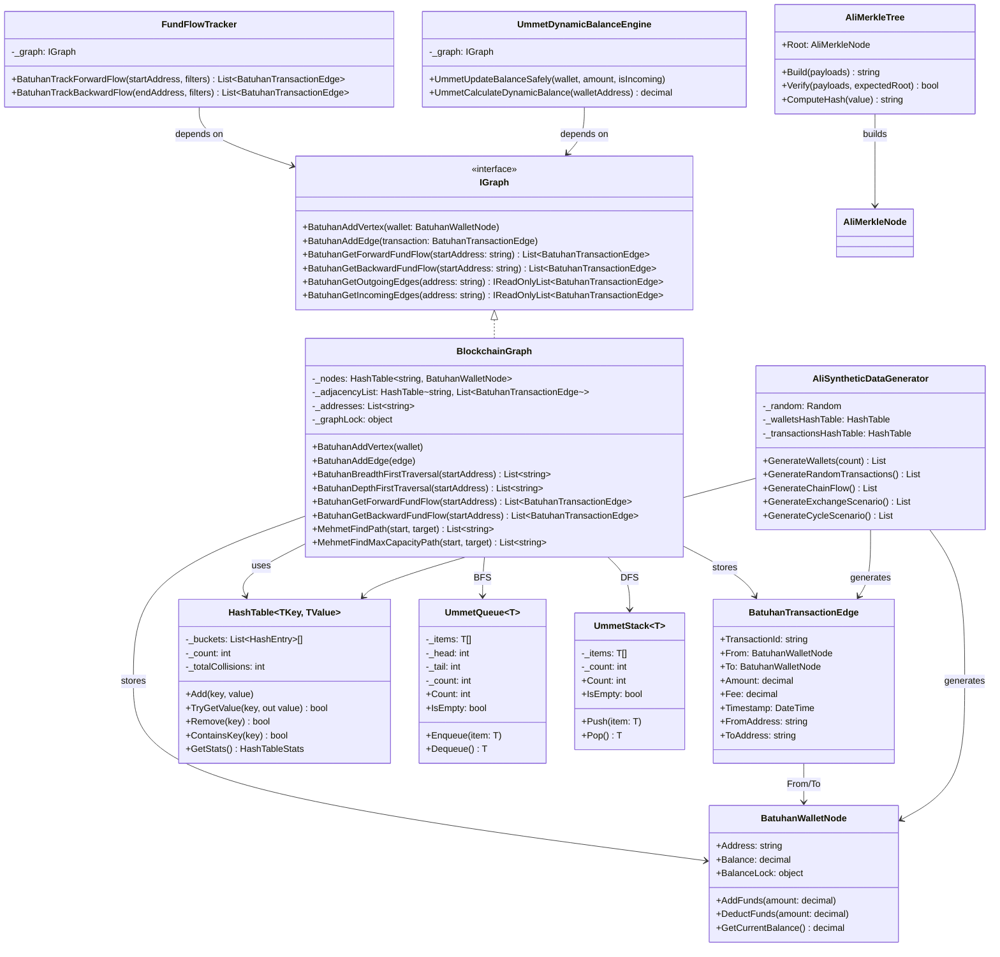
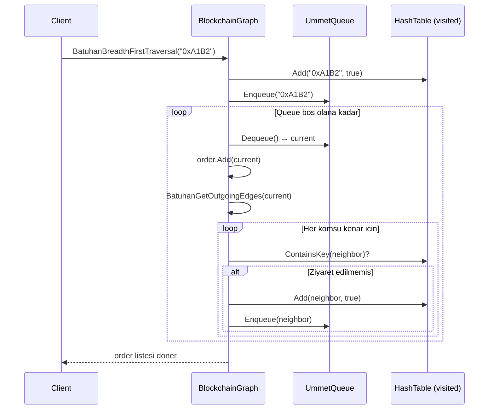
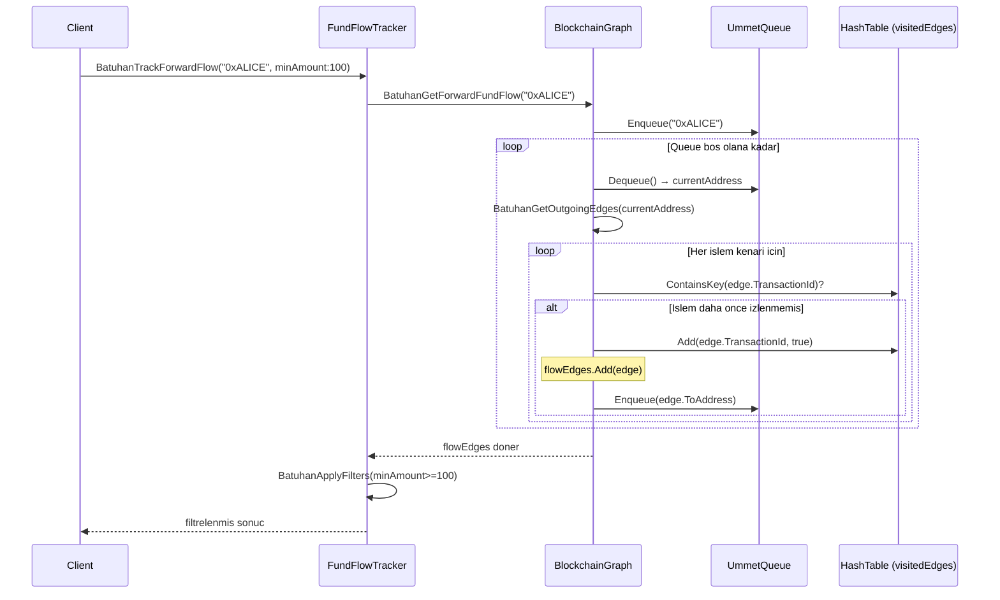
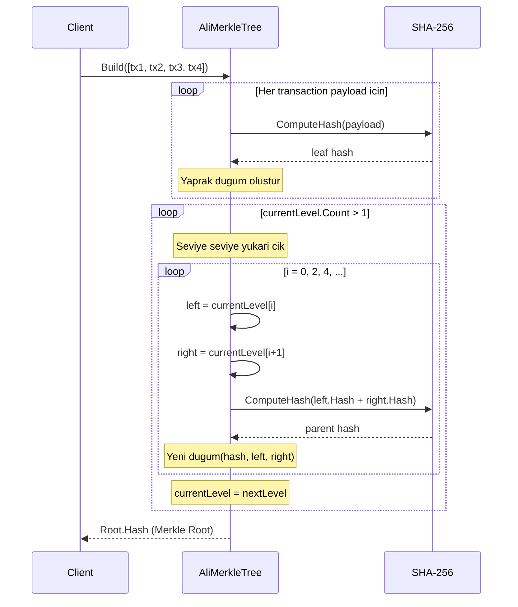

# UML Diyagramlari - Blokzincir Islem Aglari Analizi

> Bu dosyadaki Mermaid diyagramlarini gorsellestirmek icin:
> - [Mermaid Live Editor](https://mermaid.live) adresine yapistirin
> - Veya GitHub uzerinde direkt goruntulenebilir

---

## 1. Sinif Diyagrami (Class Diagram)

---

## 2. BFS Algoritmasi Sekans Diyagrami

---

## 3. Ileriye Donuk Fon Akisi Sekans Diyagrami

---

## 4. Merkle Tree Build Sekans Diyagrami

